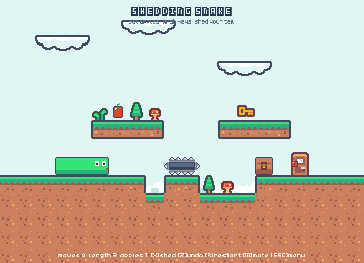
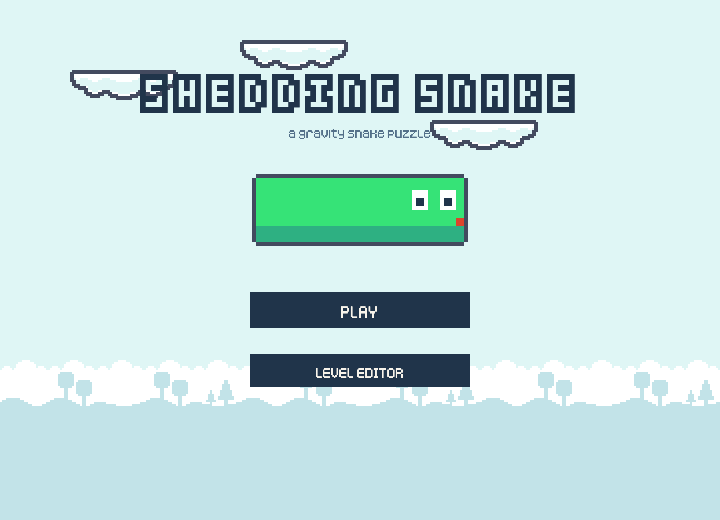
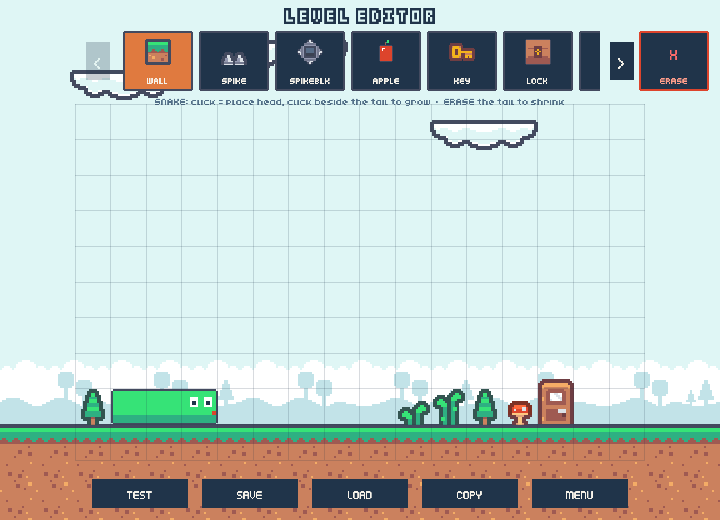

# 🐍 断尾蛇 Shedding Snake

**一款重力贪吃蛇解谜游戏,招牌机制:断掉尾巴,搭建世界。**

[](https://github.com/MpTree58/shedding-snake/actions/workflows/ci.yml)

[English →](README.md)



| 主菜单 | 关卡编辑器 |
|---|---|
|  |  |

吃苹果变长,身体就是桥。按 **X**,尾巴一节冻结成永久木箱——凌空也能定住。
**身体 = 血量 = 建材。**

技术栈 [Phaser 3](https://phaser.io/) + TypeScript;像素美术基于 CC0 的
[Kenney](https://kenney.nl/) 素材家族。浏览器即点即玩,无需安装。

## 特性

- **回合制重力解谜**——Snakebird 式移动:任意一节身体搭在实体上即可支撑全蛇;
  摔出场外或摔进尖刺即死(无限悔棋,死后也能悔);
- **断尾机制**——牺牲身长换取永久实体木箱,可以凌空冻结;
- **三种门**——苹果门(吃光苹果开)、钥匙门(持钥匙撞开)、无锁门(进门即赢);
- **钥匙与锁方块**——锁块可拼成整面锁墙,每格一个锁孔、耗一把钥匙;
- **尖刺方块**——所有暴露面长刺;悬在上方安全,但别让它承重、别去撞它
  (基于重量的死亡判定);
- **关卡编辑器**——用游戏内真实贴图画关卡、逐节画蛇、即时试玩、本地存档、
  一键导出 ASCII 文本;
- **闯关模式**——6 个教学关,顺序解锁,自动存档(CrazyGames 上为账号云存档)。

## 快速开始

```bash
npm install
npm run dev     # → http://localhost:5173
npm test        # 33 个规则单元测试(vitest)
npm run build   # 生产构建输出到 dist/(相对路径,可直接投游戏门户)
```

需要 Node.js 18+。不用下载任何游戏引擎——Phaser 只是一个 npm 依赖。

## 怎么玩

目标:到达门口。挂**红苹果锁**的门要吃光全场苹果才开;挂**金锁**的门需要钥匙;
素门直接进。

| 按键 | 作用 |
|---|---|
| 方向键 / WASD | 移动(身体跟随,每步之后结算重力) |
| **X** | 断尾:尾巴一节冻结成永久木箱 |
| Z | 悔棋(死后也能悔) |
| R | 重开本关 |
| M | 静音 |
| ESC | 返回菜单 / 选关 / 编辑器 |

手机:滑动移动,断尾用屏幕上的 SHED 按钮。

值得知道的规则:

- 吃苹果长一格——身长就是伸展距离;
- 没有任何一节身体搭在实体上就会下坠;摔出棋盘或摔进尖刺即死;
- **悬在**尖刺/尖刺方块上方是安全的;让尖刺方块成为唯一支撑、或主动撞它,不安全;
- 断尾木箱永久冻结在原地,凌空也不掉。

## 关卡编辑器

主菜单 → **LEVEL EDITOR**。在可滑动的物件条里选方块(墙/尖刺/尖刺方块/苹果/
钥匙/锁块/三种门/蛇),点击或拖拽绘制。每一笔都实时校验,草稿永远可以用
**TEST** 即时试玩(ESC 带着草稿原样返回)。**COPY** 导出 ASCII 文本,粘进
`src/levels/index.ts` 即成为正式关卡:

```
.  空      #  墙        ^  尖刺     S  尖刺方块
o  苹果    k  钥匙      L  锁块     E  苹果门
D  钥匙门  O  无锁门    H  蛇头     1..9  蛇身
```

## 架构

```
src/
  core/     纯 TypeScript 游戏规则——零渲染依赖、全量单元测试、可整体移植
  levels/   ASCII 字符画关卡
  render/   Phaser 场景(菜单/选关/游戏/编辑器)+ 共享 BoardRenderer,
            编辑器预览与游戏画面永不走样
  progress.ts    闯关进度,存档后端可插拔
  crazygames.ts  CrazyGames SDK v3 包装(平台外自动降级为无操作)
```

所有画面元素在启动时生成或自动拼接:地形、锁方块、尖刺方块都是 16 态连接
家族;蛇为程序化绘制(连接感知的身体、带朝向的表情脸)。

## 致谢

- 瓦片、音效、音乐、字体:[Kenney](https://kenney.nl/)(CC0)与
  [Juhani Junkala](https://opengameart.org/content/5-chiptunes-action)(CC0)
- 蛇、苹果、挂锁、尖刺/锁方块像素画:原创,按 Kenney 调色板绘制
- 灵感来自 [Snakebird](https://store.steampowered.com/app/357300/Snakebird/)
  (Noumenon Games)——快去买,是神作

## 许可证

代码 [MIT](LICENSE);内置第三方素材均为 CC0。
